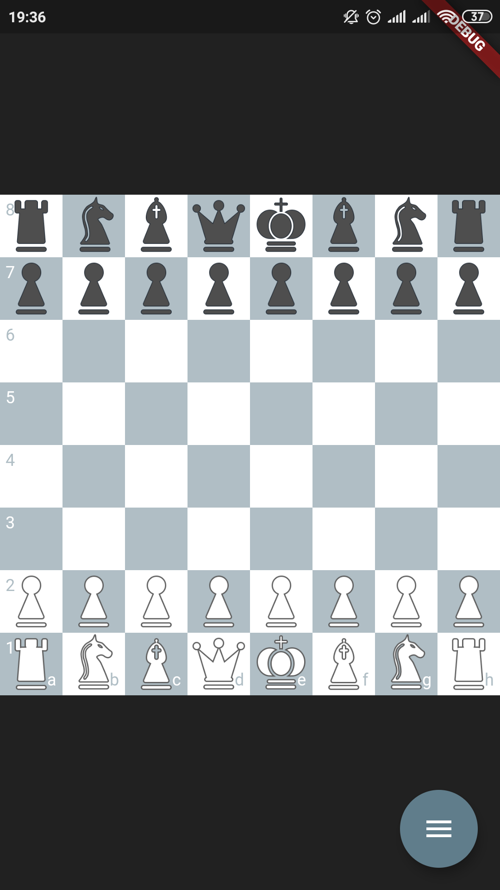
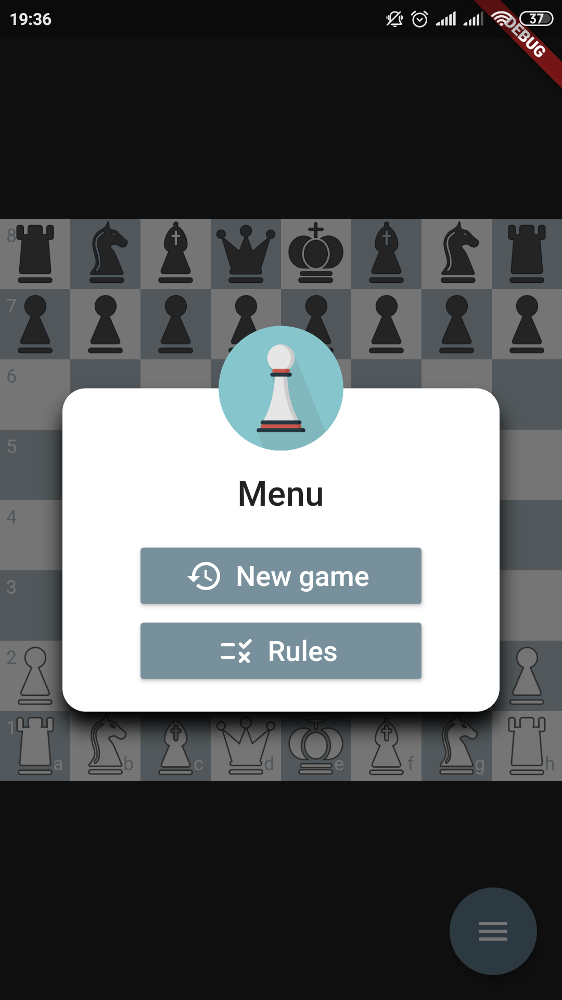

<h1 align="center">
  
  

    Flutter Chess
  

</h1>

  
  

## Projeto

O intuito do projeto é a reescrita (um pouco menos robusta) da biblioteca [chess.js](https://github.com/jhlywa/chess.js) em Dart + sua implementação em algo minimamente jogável. Minha inspiração para o projeto veio deste [vídeo](https://www.youtube.com/watch?v=JulJJxbP_T0&ab_channel=WilliamCandillon), do [William Candillon](https://github.com/wcandillon).

O xadrez é um jogo de estratégia abstrato e não envolve informações ocultas. É jogado em um tabuleiro quadrado com 64 quadrados dispostos em uma grade de 8x8 (oito por oito). No início, cada jogador (um controlando as peças brancas, o outro controlando as peças pretas) controla dezesseis peças: um rei, uma rainha, duas torres, dois cavalos, dois bispos e oito peões. O objetivo do jogo é dar xeque-mate ao rei do oponente, pelo qual o rei está sob ataque imediato (em "xeque") e não há como escapar dele. Existem também várias maneiras de um jogo terminar empatado.

## Features

Esse projeto foi desenvolvido com as seguintes tecnologias:

- [Flutter](https://flutter.dev/)
- [Dart](https://dart.dev/)

## Utilizando o projeto

1. Clone o repositório utilizando: `git clone git@github.com:yuriazevedo11/chess.git`
2. Entre na pasta do repositório: `cd chess`
3. Rode `flutter run` para o iniciar a aplicação no emulador ou em seu dispositivo

OBS: Caso tenha escolhido rodar pelo emulador Android, você terá que abri-lo antes de rodar o comando, no iOS ele abre sozinho.
